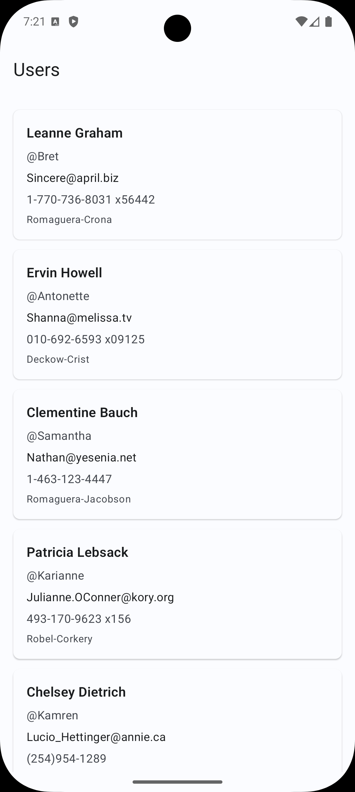
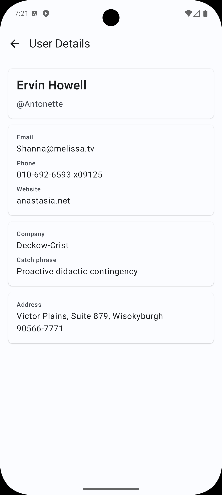

# UserDirectory

## Overview

UserDirectory is a small native Android application built for an Android assessment. It displays users from a public API and opens a detail screen for a selected user.

The app is intentionally simple, but the project structure is set up to show clean Gradle configuration, modular boundaries, testable UI, dependency injection, and maintainable Kotlin code.

## Requirements Covered

- 2 screens: user list and user detail
- API integration with primary and fallback endpoints
- Modular architecture
- Jetpack Compose
- Kotlin
- Koin dependency injection
- Ktor networking
- Coroutines and Flow
- Clean Architecture
- MVI
- Unit tests
- Compose UI tests
- Screenshot and demo references

## Tech Stack

- Kotlin
- Jetpack Compose
- Material 3
- Koin
- Ktor Client
- Kotlinx Serialization
- Coroutines / Flow
- Clean Architecture
- MVI
- Gradle Version Catalog
- JUnit
- MockK
- Coroutine Test
- Compose UI Testing

## Architecture

The app uses a small Clean Architecture setup with MVI at the presentation layer.

Presentation contains Compose UI, screen contracts, ViewModels, state, intents, and one-time effects. Screens are split into route-level composables and stateless content composables so navigation and state collection stay separate from UI rendering.

Domain contains use cases, repository contracts, and non-null domain models.

Data contains Ktor remote data sources, DTOs, mappers, repository implementations, fallback API logic, and a simple in-memory cache.

Core contains shared result handling, error models, dispatcher providers, and reusable network setup.

Architecture flow:

```text
Compose UI
-> Intent
-> ViewModel
-> UseCase
-> Repository
-> RemoteDataSource
-> Ktor API
-> DTO
-> Mapper
-> Domain Model
-> State
-> Compose UI
```

## Module Structure

```text
:app
:core:common
:core:network
:core:testing
:feature:users
```

`:app` owns Android-only setup, the application class, main activity, app theme, Koin startup, and navigation.

`:core:common` owns shared result wrappers, error models, and dispatcher abstractions.

`:core:network` owns Ktor client setup, JSON configuration, and network constants.

`:core:testing` owns coroutine test helpers and fake dispatcher providers.

`:feature:users` owns the user feature data, domain, presentation, Koin bindings, unit tests, and Compose UI tests.

Dependency direction:

```text
:app -> :feature:users
:feature:users -> :core:common
:feature:users -> :core:network
```

Feature logic is not placed in `:app`, and DTOs are not exposed outside the data layer.

## API

Primary API:

```text
https://fake-json-api.mock.beeceptor.com/users
```

Fallback API:

```text
https://jsonplaceholder.typicode.com/users
```

The fallback endpoint is used only if the primary assignment endpoint is unavailable. DTO fields are nullable because the sample APIs can be inconsistent. Domain models use non-null values with safe defaults.

## Why Koin and Ktor

Koin was used because it is lightweight and keeps dependency setup simple for a small modular project.

Ktor was used because it is Kotlin-first, coroutine-friendly, and keeps the network layer easier to move toward Kotlin Multiplatform in the future.

## KMP-ready Note

The app is implemented as a native Android project as requested. Koin, Ktor, Kotlinx Serialization, and Android-independent data/domain layers were chosen to keep the lower layers Kotlin-first and easier to move toward Kotlin Multiplatform in the future if needed.

## How to Run

1. Clone the repository.
2. Open the project in Android Studio.
3. Select the `app` run configuration.
4. Run on an emulator or Android device.

Command line:

```bash
./gradlew :app:assembleDebug
```

Install and launch on a connected emulator or device:

```bash
./gradlew :app:installDebug
adb shell am start -n com.sumit.userdirectory/.MainActivity
```

## How to Test

Run all local unit tests:

```bash
./gradlew test
```

Run feature unit tests:

```bash
./gradlew :feature:users:testDebugUnitTest
```

Run Compose UI tests on a connected emulator or device:

```bash
./gradlew connectedDebugAndroidTest
```

Run only the user feature Compose UI tests:

```bash
./gradlew :feature:users:connectedDebugAndroidTest
```

## Screenshots

User list:



User detail:



## Demo Video

[Demo video](docs/demo/user-directory-demo.webm)

## Assumptions

- The API provides sample user data.
- Some DTO fields may be missing, so safe defaults are used.
- In-memory cache is enough for this small assignment.
- Offline database storage is not included due to assignment scope.
- Android is the target platform for this submission.
- Pagination is not required for the current API response size.

## Possible Improvements

- Room or SQLDelight offline cache
- Pull to refresh
- Pagination
- Better network error classification
- Screenshot testing
- GitHub Actions CI
- Baseline profiles
- Accessibility audit
- More detailed UI polish
- KMP shared module extraction
